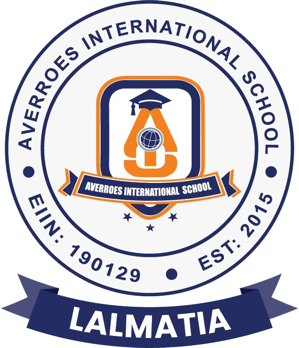
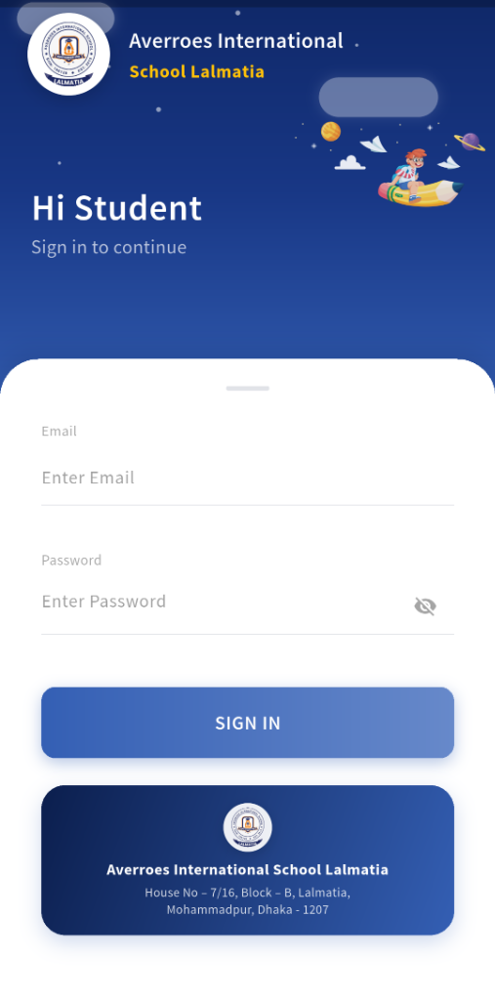
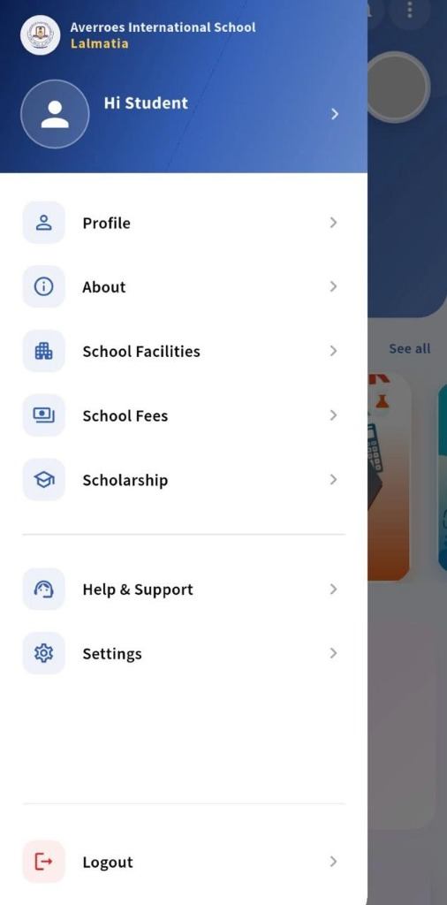
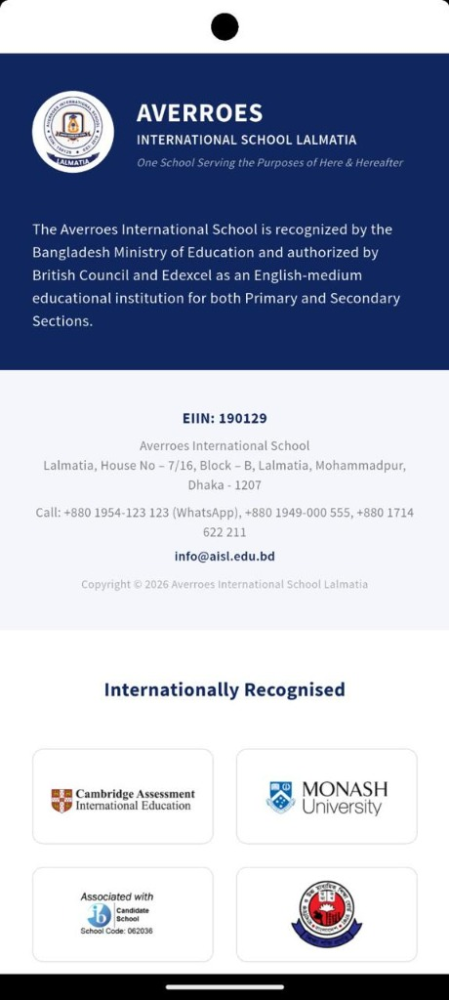
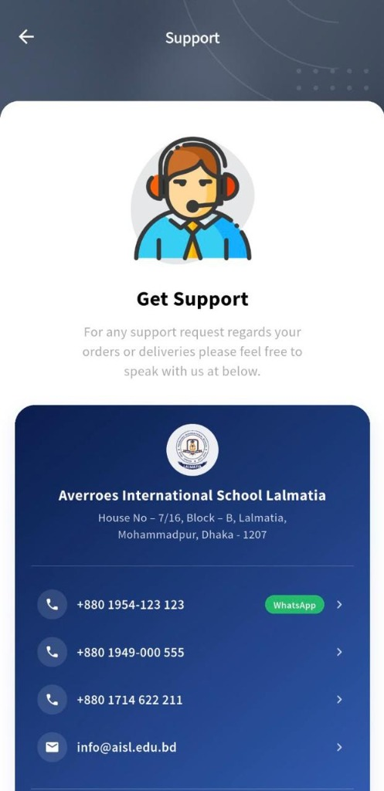

<p align="center">
  
</p>

<h1 align="center">Averroes International School (AISL)</h1>
<h3 align="center">Student & Smart Transit Driver App — Lalmatia Branch</h3>

<p align="center">
  <em>"One School Serving the Purposes of Here & Hereafter"</em>
</p>

<p align="center">
  <a href="https://rokibul-islam-robi.github.io/averroes-student-transit-driver-app--Lalmathia-Branch-/">
    
  </a>
  <a href="https://github.com/Rokibul-Islam-Robi/averroes-student-transit-driver-app--Lalmathia-Branch-/actions">
    
  </a>
  
  
</p>

<p align="center">
  <b>🌐 Live Web Portal:</b> <a href="https://rokibul-islam-robi.github.io/averroes-student-transit-driver-app--Lalmathia-Branch-/">https://rokibul-islam-robi.github.io/averroes-student-transit-driver-app--Lalmathia-Branch-/</a>
</p>

---

## 📌 Executive Summary & Purpose

The **Averroes Student & Smart Transit Application** is an enterprise-grade mobile and web solution developed for the students, guardians, teachers, and transit drivers of **Averroes International School (Lalmatia Branch)**. 

The application streamlines student academic workflows, communication channels, digital fee settlements, and features a state-of-the-art **Live GPS Smart Bus Transit & QR Attendance System** to ensure maximum safety, transparency, and operational efficiency across school transit operations.

---

## 📱 Application Interface Overview

<div align="center">
  <table>
    <tr>
      <td align="center" width="25%">
        
        <br/><b>🔐 1. Secure Authentication</b>
      </td>
      <td align="center" width="25%">
        
        <br/><b>🧭 2. Enterprise Navigation Hub</b>
      </td>
      <td align="center" width="25%">
        
        <br/><b>🏛️ 3. Accreditations & Profile</b>
      </td>
      <td align="center" width="25%">
        
        <br/><b>🎧 4. Dedicated Support Desk</b>
      </td>
    </tr>
  </table>
</div>

---

## 🌟 Key Application Features

### 🚍 1. Smart Transit & Live GPS Bus Tracking
- **Live School Bus Tracking**: Real-time Google Maps GPS location tracking of school transit buses.
- **QR Code Boarding**: Instant student check-in/check-out via QR scan for reliable transit attendance.
- **Driver Transit Dashboard**: Specialized interface for drivers to initiate trips, broadcast live location, and log passenger records.
- **Trip History & Route Logs**: Historical transit reports accessible for school administration and parents.

### 📚 2. Academic Management & E-Learning
- **Live Class Hub**: Seamless access to active virtual classrooms and schedule reminders.
- **Daily Class Routine & Timetable**: Dynamic daily and weekly academic period schedule.
- **Homework & Assignment Management**: Submission tracking, downloadable teacher instructions, and deadline alerts.
- **Examination Portal & Report Cards**: Date-sheets, syllabus details, and terminal term performance cards.
- **Teachers' Resource Materials**: Document libraries, announcements, and study files.

### 💳 3. Fee Management & Digital Payments
- **Tuition & Dues Overview**: Real-time summary of paid and outstanding invoices.
- **bKash Digital Payment**: Quick and secure fee clearance directly through bKash payment gateway.
- **Digital Invoices & Receipts**: Downloadable payment vouchers with transaction ID verification.

### 🏫 4. Institutional Profile & Campus Facilities
- Comprehensive guide to campus facilities, library, laboratories, and prayer areas.
- Detailed scholarship criteria and application guidelines.
- Official leadership messages, school holidays calendar, and institutional updates.

### 🎧 5. One-Touch Help & Emergency Support
- Direct WhatsApp integration (`+880 1954-123 123`) for immediate assistance.
- Dedicated hotline switchboard (`+880 1949-000 555`, `+880 1714 622 211`).
- Official institutional email desk (`info@aisl.edu.bd`).

---

## 🚀 Live Web Hosting & Deployment

The application is fully configured for continuous web deployment across both **GitHub Pages** (automated CI/CD) and **Firebase Hosting**.

### 🌐 Option A: GitHub Pages (Automated via GitHub Actions)
Every push to `main` automatically builds and deploys the latest Flutter Web app directly to:
👉 **[https://rokibul-islam-robi.github.io/averroes-student-transit-driver-app--Lalmathia-Branch-/](https://rokibul-islam-robi.github.io/averroes-student-transit-driver-app--Lalmathia-Branch-/)**

### 🔥 Option B: Firebase Hosting (One-Command Deploy)
The repository includes a pre-configured `firebase.json` with SPA URL rewrites:

```bash
# 1. Build Flutter Web release
flutter build web --release

# 2. Deploy to Firebase Hosting
firebase deploy --only hosting
```

---

## 📥 How to Get & Install the Android APK

### ⚡ Method 1: Automated Cloud Build via GitHub Actions (Recommended)

1. Open the repository's [**Actions**](https://github.com/Rokibul-Islam-Robi/averroes-student-transit-driver-app--Lalmathia-Branch-/actions) tab.
2. Select the latest completed run under **"Build Android APK & Deploy Web"** (marked with a green checkmark ✅).
3. Scroll down to the **Artifacts** section at the bottom of the page.
4. Click on **`release-apk`** to download the archive containing `app-release.apk`.
5. Extract the `.zip` file on your Android device and tap **`app-release.apk`** to install.

> **💡 Android Installation Tip:** If prompted during installation, enable *"Install from Unknown Sources"* or tap *"Install anyway"* if Google Play Protect presents a verification prompt.

---

### 💻 Method 2: Manual Local Build (Developers)

```bash
# 1. Clone the repository
git clone https://github.com/Rokibul-Islam-Robi/averroes-student-transit-driver-app--Lalmathia-Branch-.git
cd averroes-student-transit-driver-app--Lalmathia-Branch-

# 2. Install dependencies
flutter pub get

# 3. Build Release APK
flutter build apk --release
# Generated output: build/app/outputs/flutter-apk/app-release.apk

# 4. Build Flutter Web Release
flutter build web --release
# Generated output: build/web/
```

---

## 🏛️ Institutional Profile & Accreditations

**Averroes International School** is an internationally accredited, English-medium educational institution committed to academic excellence and moral uprightness:

- **Recognition**: Recognized by the **Ministry of Education, Government of the People's Republic of Bangladesh**.
- **Authorization**: Authorized by the **British Council** and **Pearson Edexcel** for Primary and Secondary educational curricula.
- **Affiliation**: **Cambridge Assessment International Education**.
- **University Partner**: **Monash University**.
- **IB Association**: Associated with the **International Baccalaureate (IB Candidate School: Code 062036)**.
- **EIIN**: `190129`

---

## 🛠️ Technology Stack & Architecture

| Layer | Technology / Package |
| :--- | :--- |
| **Framework** | [Flutter 3.x](https://flutter.dev/) (Dart 3.x) |
| **Architecture / State Management** | [GetX](https://pub.dev/packages/get) (MVC / Reactive Controllers) |
| **Mapping & Geolocation** | `google_maps_flutter`, `geolocator` |
| **QR Transit Scanner** | `mobile_scanner`, `qr_flutter` |
| **UI & Layout** | `sizer`, `flutter_svg`, `flutter_staggered_grid_view` |
| **Storage & Caching** | `shared_preferences`, `path_provider` |
| **Cloud Hosting** | GitHub Pages & Firebase Hosting (`firebase.json`) |
| **CI / CD Automation** | GitHub Actions (`ubuntu-latest`, Temurin JDK 17, Flutter Stable) |

---

## 📂 Project Directory Structure

```text
averroes_student_app/
├── .github/
│   └── workflows/
│       └── build.yml               # Automated Android APK & Web CI/CD pipeline
├── Assets/
│   └── wireframe_assets/          # Vector icons, branding logos & fonts
├── lib/
│   ├── main.dart                  # Application entry point
│   └── wireframe/
│       ├── wireframe_pages/
│       │   ├── wireframe_Authentication/ # Login, Register, Academic Setup
│       │   ├── wireframe_driver/        # Driver GPS Transit, QR Scanner, Trip Logs
│       │   └── wireframe_home/          # Academics, Fees, Bus Tracking, Support
│       └── wireframe_theme/             # Theme tokens, styles, colors
├── android/                        # Native Android Gradle configuration
├── web/                            # Flutter Web PWA template & metadata
├── screenshots/                    # Application UI showcase assets
├── firebase.json                   # Firebase Hosting single-page configuration
└── pubspec.yaml                    # Flutter dependencies and asset registrations
```

---

## 📍 Campus Contact Information

* **Campus Address**: House No – 7/16, Block – B, Lalmatia, Mohammadpur, Dhaka - 1207, Bangladesh
* **Official Hotline**: `+880 1949-000 555` | `+880 1714 622 211`
* **WhatsApp Support**: `+880 1954-123 123`
* **Official Email**: `info@aisl.edu.bd`
* **Website**: [https://aisl.edu.bd](https://aisl.edu.bd)
* **EIIN Number**: `190129`

---

<p align="center">
  <b>© 2026 Averroes International School Lalmatia. All Rights Reserved.</b><br/>
  <i>Developed for institutional administrative and academic excellence.</i>
</p>
